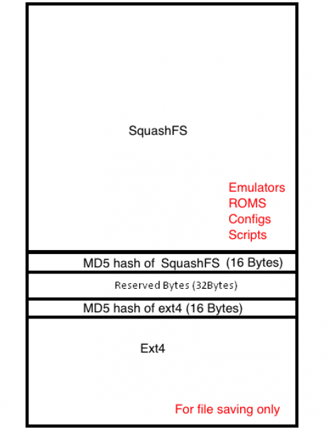
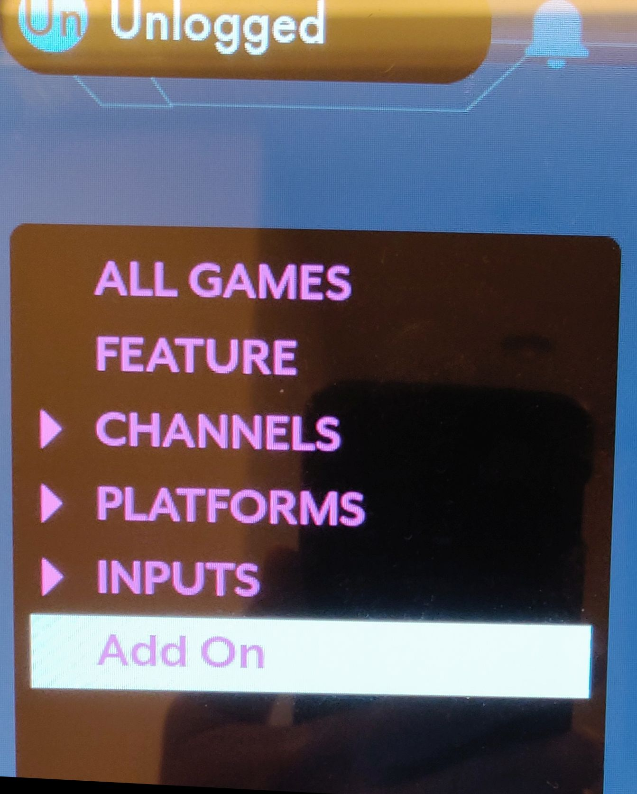

# Community Add-on

This is an unofficial guide to packing your own apps into an  "Add-on Image" for use on AtGames' Legend Ultimate home arcade.

## Disclaimer
We are not obligated to provide updates or fixes to this guide. We are not responsible if the app you developed damages or voids the warranty on the Legends Ultimate home arcade. Please use this guide responsibly, as we are strong believers in intellectual property rights and do not advocate copyright infringement in any way. It is the sole responsibility of the developer to obtain any and all rights to use and/or distribute any and all software and related items packaged.

It is the end user's sole responsibility to legally acquire any and all materials for use on a particular emulator. Such as the MAME ROMs that have been approved for free distribution by the MAME organization, please visit https://www.mamedev.org/roms/ . 

## Getting Started
The following sections will prepare your home arcade, as well as the files to be packed into an add-on image.

### Prerequisites
Make sure you have the following ready:

- Arcade console running firmware **2.0.0** or later
  - Please follow the official OTA upgrade procedure from the user manual to update your firmware to a compatible version
- A USB drive with enough storage to hold your files
  - Please make sure the drive is formatted in FAT(FAT32) file system
- Linux users: 
  - Files to be packed into the image (look under "AddOn_Warpspeed" directory)
    - Emulator .so file (LibRetro API emulator core is recommended, *Note: emulator must be compatible with LibRetro APIs*)
    - Game files (Must be compatible with the emulator above)
    - Box art 
    - XML file
    - Script file to execute the game file with the emulator (exec.sh)
- Windows users: look under "AddOn_tool“ directory for the Windows installer and its readme file

### File Structure

Please adhere the following file structure when preparing your add-on image

```
+----------+ 
|   PKG    | <-- name the root directory whatever you want, in the example above,
+---+------+      it would be "AddOn_Warpspeed"
    |
    |   +---------+ 
    +-- |   emu   |  <-- subdirectory for emulators' *.so and config files
    |   +---------+      (for mame2003+, we would need a "retroarch.cfg", "metadata" sub-
    |                    folder, and "mame2003_plus_libretro.so".)
    |
    |   +---------+ 
    +-- |   roms  |  <-- subdirectory for the game files 
    |   +---------+      this example uses "Warpspeed.bin"
    |                    
    |   +---------+ 
    +-- | boxart  |  <-- subdirectory for boxart, "boxart.png" is the default name.
    |   +---------+
    |
    |   +---------+ 
    +-- |  save   |  <-- subdirectory for gamesave files
    |   +---------+
    |   
    +--  title       <-- symbolic link to "boxart/boxart.png"
    |   
    +--  cartridge.xml  <-- info header for menu display. *in XML format
    |   
    +--  exec.sh        <-- the script file to run emulator and game files.
                            the example contains:
                            /emulator/retroplayer ./emu/genesis_plus_gx_libretro.so "./roms/Warpspeed.bin"
```
#### Optional: Bezel Art Support

To set a bezel art for the game, add a 1280x720 PNG file under /boxart, name it "addon.z.png".

Then update "exec.sh" to be as follows:

```shell
#!/bin/sh

cp ./boxart/addon.z.png /tmp
echo -e "[Property]\nBezelPath=/tmp/addon.z.png" > /tmp/gameinfo.ini

set -x
/emulator/retroplayer ./emu/genesis_plus_gx_libretro.so "./roms/Warpspeed.bin"

rm -f /tmp/gameingo.ini
```

## Building the Add-on Image

After preparing the files into the structure above, run the following Linux shell script to make a .UCE image file

```shell
build_sq_cartridge_pack.sh ./AddOn_Warpspeed ./AddOn_Warpspeed.UCE
```

The stack inside the Add-on image looks like this:




## Batch Building Images

Use the following steps if you'd like to automate the build process and build many games at once

- prepare the add-on images the same way as before (use the file structure described earlier)
- preferably, make a new directory and move all the add-on directories under it, like so:
```
+----------+ 
|   games  | <-- parent directory
+---+------+      
    |
    |   +---------+ 
    +-- | addOn1  |  <-- game 1
    |   +---------+      
    |     
    |   +---------+ 
    +-- | addOn2  |  <-- game 2
    |   +---------+      
    .
    .
    .
    |   +---------+ 
    +-- | addOnX  |  <-- game X
        +---------+      
```
- make sure the **batch_build.sh** is executable and in the same directory as **build_sq_cartridge_pack.sh** and run the following command 

  - 1st arg is source directory (optional, defaults to pwd)
  - 2nd arg is output directory (optional, defaults to pwd)
  
  ```bash
  ./batch_build.sh ./games 
  ```

- the batch script will go under the source directory and run the build script against each sub-directory
- the output file names will be the same as the sub-directory names

## Playing on the Console

Copy the output Warpspeed.UCE file from the previous section into the root of the USB drive, then insert the drive into either USB slots on the console's control-top. 

Navigate to the GAME page and the system should automatically load the game(s) if the image is valid, and a new filter named "Add-on" will appear on the left side of the [Games] menu.



Select the game and enjoy!

## FAQs

Q: What's the size limit of the add-on image
> This is limited by the size of the USB drive and the FAT filesystem, it will be automatically mounted by the Linux system and not use any system storage

Q: Will my add-on game saves disappear when I unplug the USB drive?
> The game saves are stored inside the image on the USB drive, not in the console. Therefore they should be there as long as the files on the drive remains intact

Q: I accidentally loaded an incompatible add-on image and my screen turned black, how do I get out of this?
> You should be able to force quit the game by pressing <MENU> button twice. If not then simply power cycle the console and you will be back to the main screen

Q: I'd like to develop my own games and try them out on the arcade, where do I start?
> I'm looking into this now, check back in a bit and I'll update this repo with what I can find.

## Versioning 
We will try to follow the SemVer convention, starting with 0.9.0.
